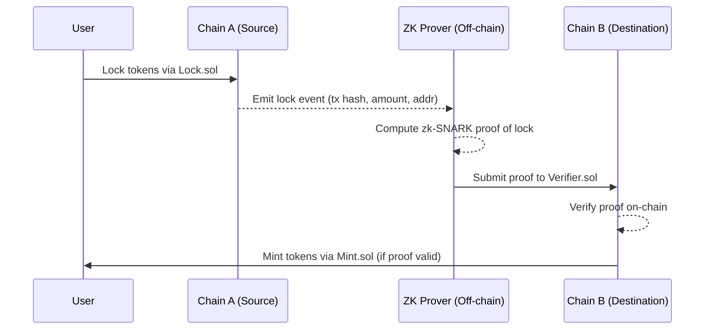

# zkBridge_DEMO

This project was completed as the Final Project for **"Generative AI and Blockchain 2025"** at GIST, supervised by Professor Heung-No Lee.

---

## 🔗 Overview

**zkBridge_DEMO** is a prototype that demonstrates how to bridge tokens between two blockchains using **zero-knowledge proofs** (ZK-SNARKs) for trustless verification. In a traditional cross-chain bridge, a trusted intermediary or a federation of nodes is often required to confirm events on one chain to another. This reliance on third parties has led to significant security risks and exploits in existing bridges. Using ZK-SNARKs, a **zkBridge** allows one chain to *cryptographically verify* events (like token lock transactions) that occurred on another chain **without trusting any intermediaries or revealing private data**. This enhances security by removing external trust assumptions: the proof itself mathematically guarantees the validity of the cross-chain event.

This demo focuses on a simple **lock-and-mint** scenario: a user locks ERC-20 tokens on **Chain A (source)** and, via a generated zk-SNARK proof of that lock, mints corresponding tokens on **Chain B (destination)**. The zero-knowledge proof ensures that Chain B can verify the token lock on Chain A *entirely through on-chain verification*, eliminating the need for a centralized bridge or oracle. While simplified, this project serves as an educational example of how **blockchain interoperability** can be achieved with zk-SNARK proofs, laying the groundwork for more advanced trustless bridges in the future.

---

## How It Works (High-Level Architecture)

The bridging process in zkBridge_DEMO involves both on-chain smart contracts and off-chain proof generation. **Below is the step-by-step flow from the source chain to the destination chain using zk-SNARK proofs:**

1. **Lock on Source Chain (Chain A):** A user locks a certain amount of an ERC-20 token on Chain A by calling a `Lock.sol` smart contract. This contract holds the tokens and records the lock event (including the amount and recipient address) on Chain A.

2. **Proof Generation (Off-Chain):** After the lock transaction, an off-chain process (run by the user or a relayer) gathers the necessary data (e.g. the transaction hash or event details of the lock). Using a Circom circuit (`lockproof.circom`), the off-chain prover generates a **zk-SNARK proof** that attests *to the existence of the locked tokens event on Chain A*. In this demo, the circuit uses a **Keccak256 hash** to verify the lock event data (e.g. hashing the locked amount and user address) inside the proof. The proof is a succinct cryptographic artifact that will convince others of the lock event's truth without revealing sensitive information.

3. **Verification on Destination Chain (Chain B):** The generated proof is then submitted to the `Verifier.sol` contract on Chain B. This contract contains the **zk-SNARK verifier key** (generated by SnarkJS for the `lockproof` circuit) and is able to check the validity of the proof entirely on-chain. When the user (or relayer) calls the verifier contract with the proof, the contract returns `true` if and only if the proof is valid (meaning the proof indeed corresponds to a real lock event on Chain A that meets the circuit's conditions).

4. **Mint on Destination Chain (Chain B):** Upon a successful proof verification, the system can then mint the equivalent amount of tokens on Chain B for the user. In this demo, `Mint.sol` is a contract on Chain B (designed to inherit from the verifier) that would handle minting a new token that represents the bridged asset. *Note:* The current implementation includes a `Mint.sol` stub, but the actual minting logic is not fully hooked up (see **Limitations**). However, conceptually, this is where the locked tokens on Chain A are reflected as newly minted tokens on Chain B after proof validation.

This architecture ensures that Chain B only mints tokens if the proof from Chain A's lock event is valid, thereby achieving a trustless bridge: Chain B does not need to trust Chain A's data directly or any third party, only the validity of the zk-SNARK proof.



---

## 🧩 Open Source Utilized

This project utilizes the following open-source GitHub repositories:

- [snarkjs](https://github.com/iden3/snarkjs)
- [keccak256-circom](https://github.com/vocdoni/keccak256-circom)

The CIRCOM circuit files from the above repositories have been copied and included in the `circuits` directory of this project.

---

## ⚙️ GPT-Vibe Coding & Disclaimer

The following files were primarily developed using **ChatGPT-assisted vibe coding**:

- `lockproof.circom`
- `generate_input.py`
- Solidity contracts

Approximately **80% of the implementation** was generated via AI assistance and **20% manually revised**. As a result, there may still be **functional or security vulnerabilities**. **Use on a blockchain mainnet is NOT recommended**. Please validate thoroughly on testnets before any real-world application.

---

## ✅ Features

This demo project includes the following key components:

1. **ERC-20 Token Deployment** and **Lock Smart Contract** on Chain A  
2. **Zero-Knowledge Proof Generation** circuit for lock transaction hash  
3. **Verifier Circuit and Mint Contract** on Chain B

---

## ❗ Limitations

The project does **not yet support** the following:

- Full block proof generation and light client for the destination chain  
- Token minting logic within `Mint.sol` smart contract

---

## 🚀 How to Run

1. Deploy `Token.sol` and `Lock.sol` on **Blockchain A (Sender)**.
2. Lock a specific amount of tokens using the deployed `Lock` contract.
3. Modify `generate_input.py` with your wallet address and lock amount.
4. Run the following command:

   ```bash
   python3 generate_input.py
   ```

   (See `command.txt` for full command list.)

5. Execute commands (2) through (7) in order.  
   > ⚠️ Command (4) takes ~10 minutes to complete.

6. Deploy `Verifier.sol` (from Step 4) and `Token.sol` to **Blockchain B (Receiver)**.
7. Input the proof output from Command (7) into the deployed `Verifier.sol` to check for `True/False`.
8. _(Optional)_ Use `Mint.sol` (which inherits from `Verifier.sol`) to confirm behavior based on the proof result.

---

## 🎥 Demo Video (Korean)

Check out the demo video on YouTube:

👉 [Watch the Demo (Part 1)](https://youtu.be/COa2lm1Bgr4)
👉 [Watch the Demo (Part 2)](https://youtu.be/4rm2FhoOV0o)

---

## 📁 Project Structure

```
zkBridge_DEMO/
│
├── circuits/                # CIRCOM circuit files
├── contracts/               # Solidity smart contracts
├── generate_input.py        # Script to prepare input.json
├── command.txt              # CLI commands for proof generation
└── README.md                # Project documentation
```
---

